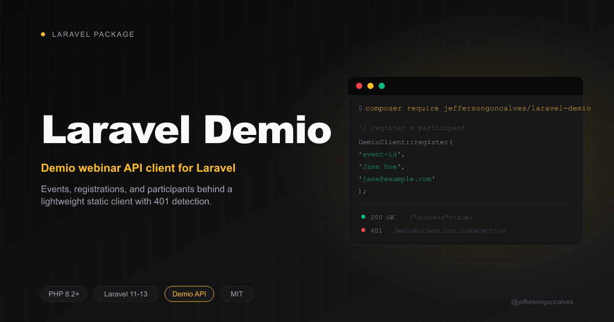

# Laravel Demio

[](https://github.com/jeffersongoncalves/laravel-demio/actions/workflows/tests.yml)
[](https://github.com/jeffersongoncalves/laravel-demio/actions/workflows/phpstan.yml)
[](https://github.com/jeffersongoncalves/laravel-demio/actions/workflows/fix-php-code-style-issues.yml)
[](https://packagist.org/packages/jeffersongoncalves/laravel-demio)
[](https://packagist.org/packages/jeffersongoncalves/laravel-demio)
[](LICENSE.md)

A lightweight [Demio](https://www.demio.com) webinar REST API v1 client for Laravel. It wraps the `my.demio.com/api/v1` calls behind a small static client, threads your `Api-Key`/`Api-Secret` credentials, and centralises 401 detection so callers get a thrown `DemioAuthenticationException` rather than a silent failure during a bad-credential window.

## Features

- **Events** — `events()` to list (optionally filtered by `upcoming`/`past`/`all`), `event()` to fetch one, `eventDate()` for a specific session date
- **Registration** — `register()` to sign a participant up for an event (and optionally a specific date)
- **Participants** — `participants()` to list who's registered for a date
- **Health check** — `ping()`
- **Credential aware** — throws `DemioAuthenticationException` on a 401 so a bad Api-Key/Api-Secret pair doesn't look like "no data"

## Installation

```bash
composer require jeffersongoncalves/laravel-demio
```

Optionally publish the config file:

```bash
php artisan vendor:publish --tag="demio-config"
```

## Configuration

Add to your `.env`:

```env
DEMIO_API_KEY=your-api-key
DEMIO_API_SECRET=your-api-secret
```

Find both at [my.demio.com/integrations/api](https://my.demio.com/integrations/api).

### Config Options

```php
// config/demio.php
return [
    'api_key' => env('DEMIO_API_KEY'),
    'api_secret' => env('DEMIO_API_SECRET'),
    'base_url' => env('DEMIO_BASE_URL', 'https://my.demio.com/api/v1'),
    'timeout' => (int) env('DEMIO_TIMEOUT', 8),
];
```

## Usage

```php
use JeffersonGoncalves\Demio\DemioClient;

// Health check
DemioClient::ping();

// List events
$events = DemioClient::events();
$upcoming = DemioClient::events('upcoming'); // upcoming|past|all

// Fetch a single event / date
$event = DemioClient::event('event-id');
$date = DemioClient::eventDate('event-id', 'date-id');

// Register a participant
DemioClient::register('event-id', 'Jane Doe', 'jane@example.com', dateId: 'date-id', refUrl: 'https://example.com');

// List participants for a date
$participants = DemioClient::participants('date-id');
```

### Handling authentication failures

```php
use JeffersonGoncalves\Demio\Exceptions\DemioAuthenticationException;

try {
    $events = DemioClient::events();
} catch (DemioAuthenticationException $e) {
    // Api-Key/Api-Secret is missing, wrong, or revoked.
}
```

## Testing

```bash
composer test
```

## Static Analysis

```bash
composer analyse
```

## Code Formatting

```bash
composer format
```

## Changelog

Please see [CHANGELOG](CHANGELOG.md) for more information on what has changed recently.

## License

The MIT License (MIT). Please see [License File](LICENSE.md) for more information.
